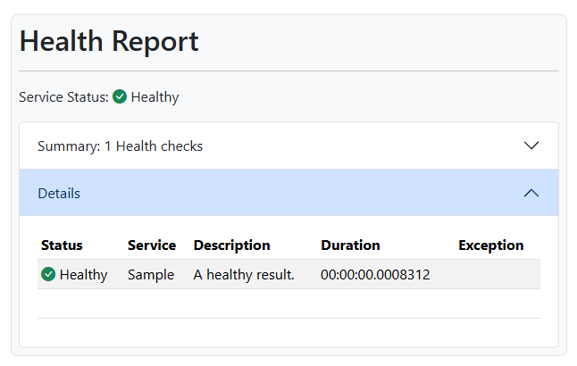

# WebPx.Web.HealthUI.Razor
A library for displaying a basic health check UI for your web application.

## Introduction

The Health Check UI is a basic UI that shows ou the Sevice Status, the Health Checks and the Health Check Results, so that you can easily see the status of your application.

The following scree shot shows the Health Check UI in action.



## Setup

To use the Health Checks in your project you can add both libraries 
[Microsoft.Extensions.Diagnostics.HealthChecks] and [WebPx.Web.HealthUI.Razor] to your project.

1. Add required Nuget packages

a. You can add the required nuget packages to your project file

```xml
  <ItemGroup>
    <PackageReference Include="Microsoft.Extensions.Diagnostics.HealthChecks" Version="8.0.12" />
    <PackageReference Include="WebPx.Web.HealthUI.Razor" Version="1.0.0" />
  </ItemGroup>
```

b. Or Install the packages in the Package Manager:

```
install-package Microsoft.Extensions.Diagnostics.HealthChecks
install-package WebPx.Web.HealthUI.Razor
```

c. Or Install the packages in the command prompt
 
```
dotnet add package Microsoft.Extensions.Diagnostics.HealthChecks --version 8.0.12
dotnet add package WebPx.Web.HealthUI.Razor --version 1.0.0
```

2. Add the depenencies from CDNJS to your libman.json file 
or create a new libman.json file with the following content

```json
{
  "version": "3.0",
  "defaultProvider": "cdnjs",
  "libraries": [
    {
      "provider": "cdnjs",
      "library": "bootstrap@5.3.3",
      "destination": "wwwroot/lib/bootstrap/",
      "files": [
        "js/bootstrap.bundle.min.js",
        "js/bootstrap.bundle.min.js.map",
        "css/bootstrap.min.css",
        "css/bootstrap.min.css.map"
      ]
    },
    {
      "provider": "cdnjs",
      "library": "bootstrap-icons@1.11.3",
      "destination": "wwwroot/lib/bootstrap-icons/",
      "files": [
        "font/fonts/bootstrap-icons.woff2",
        "font/fonts/bootstrap-icons.woff",
        "font/bootstrap-icons.min.css"
      ]
    }
  ]
}
```

3. To customize where the files the template should find them, add the following code to your Program.cs file.
Remember just to change the paths if you have a different folder structure, do not include the .css or .js filename
```csharp
    builder.Services.AddHealthUI(c =>
    {
        c.BaseUri = "/";
        c.BootstrapPath = "/lib/bootstrap";
        c.BootstrapIconPath = "/lib/bootstrap-icons";
    });
```

4. You can also set this settings in your appsettings.json file
```json
{
  "WebPx": {
    "Health": {
      "UI": {
        "BaseUri": "/",
        "BootstrapPath": "/lib/bootstrap",
        "BootstrapIconPath": "/lib/bootstrap-icons"
      }
    }
  }
}
```